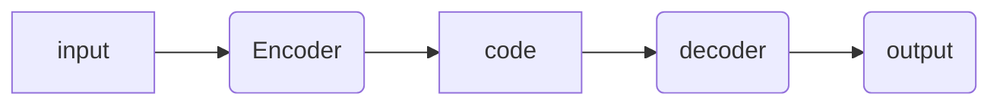
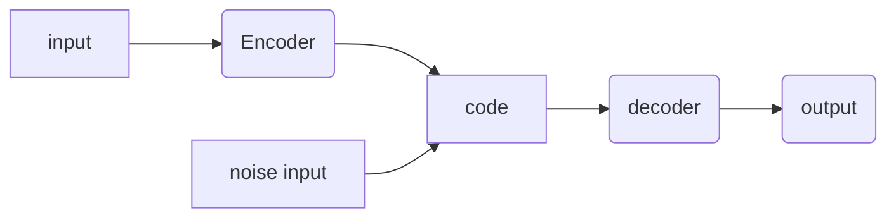
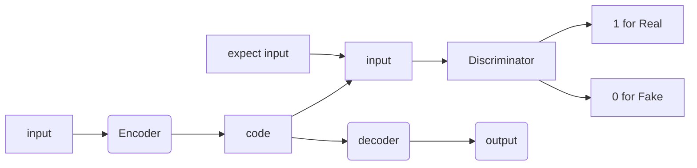
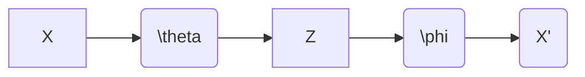

> @author:GauthierLi
>
> @date: 2021/12/20

[toc]

# Supervised Learning

- classification
- regression

but real world exit numerous unlabled datas

# Unsupervised Learning

there exist three usual types of machine learning

- 'pure' reinforement learning

​	interaction(交互) with the enviornment

​			- need a few bits for some samples

  - Supervised learning

​			- 10 - 10,000 bits per sample

   -  Unsupervised/predictive learnign

​			- millions bits per sample

why we need unsupervised learning,

- - dimension reduction
  - Processing: Huge dimention, say 224 * 224, is hard to process(将224 * 224 降为低维) 
  - Visualization: [projector.tensorflow.org](https://projector.tensorflow.org)
  - Compression, denosing, super-resolution(超分辨率)

# Auto-Encoder

the aim of auto encoder is reconstract(重建) the output same as the input via the encoder process and decoder process. Encoder process encode the input into a low dimension, and the decoder can be used for reform the result from the coded feature.

it could use to increase or decrease the feture by the **latent code** (井)

# How to train？

- loss function for binary inputs(二进制文件，如 Mnist 数据集)
   - cross-entropy error function (reconstract loss) $f(x) \equiv \hat{x} $

$$
l(f(x)) = -\sum_k (x_klog(\hat{x}) + (1-x_k)log(\hat{x_k}))
$$

- loss function for real-valued inputs
  	- sum of square differences (reconstract loss)
  	- we used a linear **activation function** at the output

$$
l(f(x)) = \frac{1}{2} \sum_k (\hat{x_k} - x_k)^2
$$

# PCA V.S. Auto-Encoders

comparing to Auto-Encoders:

- PCA, which  finds the directions of maximal variance in high-dimention data, select only those axes that have the largest variance.
- The linearity of PCA, however, places signicant limitations on the kinds of feature dimensions that can be extracted.(丢失很多信息)

# Other Auto-Encoder

- Denosing AutoEncoder

- Dropout AutoEncders
- Adversarial AutoEncoders

# Adversarial AutoEncoders

- distribution of higgen code

make the code submit to a specific ditribution.

# Another Approach -- Variationnal Auto-Encoder

- Maximum likelihood similarity

$$
l_i(\theta, \phi) = -E_{Z\sim q_{\theta}}(log[p_{\phi}(x_i|z))] + KL(q_{\theta}(z|x_i) ||p(z)) \\
$$

$$
KL(P||Q) = \int_{-\infin}^{\infin} p(x)log\frac{P(x)}{Q(x)} dx
$$

==for the first part , to reduced the reconstraction loss of auto encoders,  KL use to describe the differce between two distribution, means to make the feature simular to the specific distribution.==

# Maximize Likelihood

 realise the $E_{Z\sim q_{\theta}}(log[p_{\phi}(x_i|z))]$  part by:

- loss function for binary inputs(二进制文件，如 Mnist 数据集)
   - cross-entropy error function (reconstract loss) $f(x) \equiv \hat{x} $

$$
l(f(x)) = -\sum_k (x_klog(\hat{x}) + (1-x_k)log(\hat{x_k}))
$$

- loss function for real-valued inputs

   - sum of square differences (reconstract loss)
   - we used a linear **activation function** at the output

  $$
  l(f(x)) = \frac{1}{2} \sum_k (\hat{x_k} - x_k)^2
  $$

# Minimize KL Divergence

$KL(q_{\theta}(z|x_i) ||p(z)) $ 

to calculate the $KL(q,p) $ , we assume that 
$$
p(z_i) \sim N(\mu_1, \sigma_1^2)\\
q(z_i) \sim N(\mu_2, \sigma_2^2)
$$
then, 
$$
\begin{aligned}
KL(p,q) &= -\int p(x)log (q(x)) dx + \int p(x)log (p(x)) dx \\
&=\frac{1}{2} log(2\pi\sigma_2^2) + \frac{\sigma_1^2 + (\mu_1-\mu_2)^2}{2\sigma_2^2} - \frac{1}{2}(1+log(2\pi\sigma_1^2)) \\
&= log \frac{\sigma_2}{\sigma_1} + \frac{\sigma_1^2 + (\mu_1-\mu_2)^2}{2\sigma_2^2}-\frac{1}{2}

\end{aligned}
$$
 Though the loss function, what we get  is not a determinate feature, rather a ==ditribution==, so when we make a reconstraction, we have to make a 'sample' process to get a determinate feature vector. So, sample process is not differential.

# sample process is not differential

sample process is not differential, it hard to realize a back probagation. so ,we used a ==reparameterization trick== 
$$
z \sim N(\mu, \sigma^2)  \to z = \mu + \sigma \odot \epsilon ,\quad \epsilon \sim N(0,1)
$$
$\odot $ means dot product

# Result

 

the two pictures above are the origin pic and after AE pic

 

the two pictures above are the origin pic and after VAE pic

